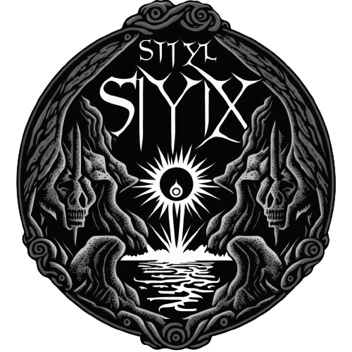

<p align="center">

</p>

This project is a program for encrypting and decrypting files and folders using an encryption key generated from a password provided by the user. It uses the AES-CBC symmetric encryption algorithm with a key derived using the PBKDF2HMAC function.

## The program includes the following features:

encrypt_file(file, password): encrypts the contents of a file with the supplied password and saves the encrypted file to disk.
decrypt_file(file, password): decrypts the contents of an encrypted file with the supplied password and saves the decrypted file to disk.
encrypt_folder(folder, password) - encrypts all files in a folder with the supplied password and saves the encrypted files to disk.
decrypt_folder(folder, password): decrypts all encrypted files in a folder with the supplied password and saves the decrypted files to disk.
generate_secure_password(): generates a random secure password.

## Dependencies

```txt
The dependencies for the script are:

os
smtplib
string
getpass
platform
datetime
secrets
sys
socket
art
cryptography
```

## Installation

Using pip:

```bash
pip install -r requirements.txt
```

## Usage

```python
python Styx.py
```
To use the program, the user can execute the main() function, which asks the user if he or she wants to encrypt or decrypt a file or folder, and requests the information needed to perform the chosen operation.

It should be noted that this program is intended for personal use and not for professional or commercial use. It should be used with care and encrypted files should be saved in a safe place.


## License

[MIT](https://choosealicense.com/licenses/mit/)
